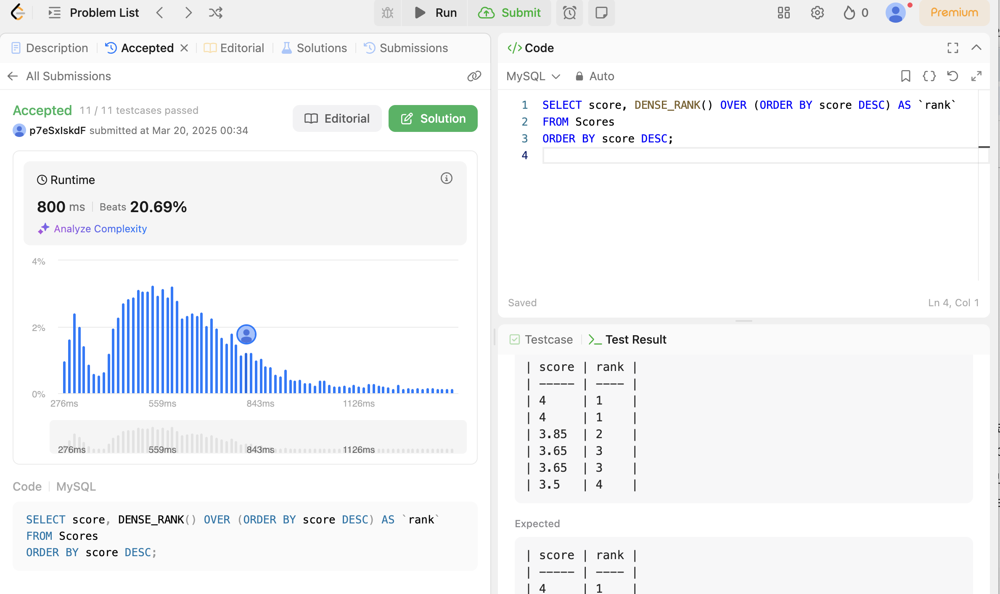
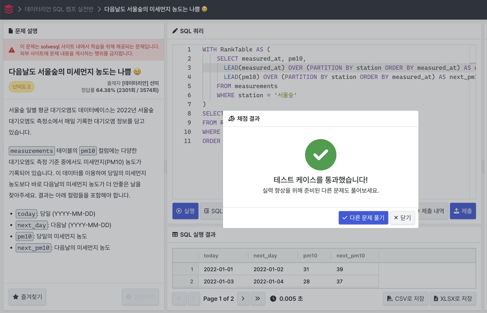
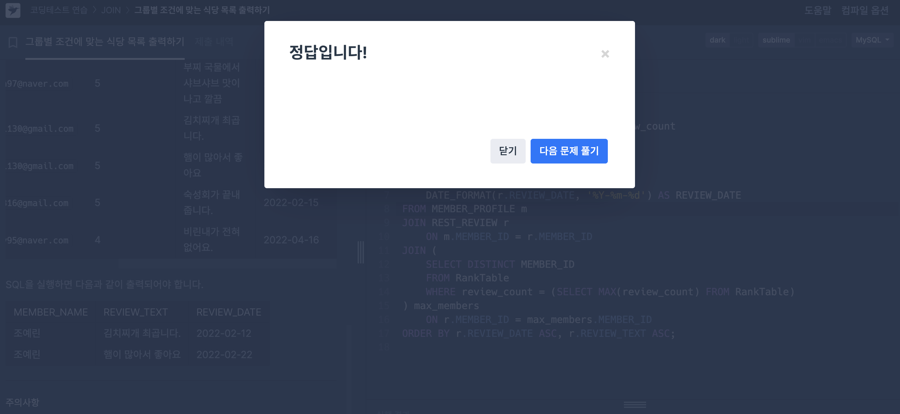

# [25-1W SQL 스터디] 1주차 공부 

## 윈도우 함수 (Window Functions) 개념정리

#### 14.20.2 

- 윈도우 함수 정의 

윈도우 함수 : 쿼리 결과의 각 행에 대해 집계 함수와 유사한 작업을 수행하지만, **집계 함수는 여러 행을 하나의 결과 행으로 결합하고, ** **윈도우 함수는 각 행에 대해 결과를 생성한다.**

> 현재 행을 기준으로 관련된 다른 행들을 '윈도우' 라는 범위로 작업을 수행함.

- OVER() 절

윈도우 함수는 OVER() 절을 활용해 윈도우 정의 방식을 결정한다. () 안에 아무것도 없을 때 전체 쿼리 결과가 하나의 윈도우가 된다. **PARTITION BY** 를 사용해서 특정 기준으로 나누거나 **ORDER BY** 를 사용해 순서 지정이 가능하다. 

- 윈도우 함수에서 사용 가능한 함수 종류들

집계 함수와 비집계함수 두 개로 나뉜다. 

1. 집계 함수 

> SUM(), AVG(), COUNT(), MIN(), MAX() 

OVER() 절을 활용해 윈도우 함수로 사용이 가능하다. 함수를 보면 그 내에서 어떤 기능을 하는지 바로 예측이 가능하다.

2. 비집계 함수

> ROW_NUMBER(), RANK(), LEAD(), LAG() 

오직 윈도우 함수로만 사용된다. 

<u>자료에서는 2가지로 써있기는 하지만 WINDOW FUNCTION은 그룹 내에 순위, 집계, 행 순서, 비율, 선형 분석을 포함한 통계 분석 함수로 5가지 분류할 수 있다.</u>

- 윈도우 함수의 문법 

윈도우 함수는 OVER(window_spec) 형태로 사용되고, window_spec에 여러 옵션을 가질 수 있다. 

~~~sql
SELECT WINDOW_FUNCTION (ARGUMENTS) OVER 
( [PARTITION BY 컬럼] [ORDER BY 컬럼] [WINDOWING 절] )
FROM 테이블명 ; 
~~~

윈도우 함수에서는 OVER 문구의 키워드가 필수로 포함되어 있어야한다. 

> WINDOW_FUNCTION : 윈도우 함수
>
> ARGUMENTS(인수) : 함수에 따라 값이 없거나 여러 개로 지정이 가능
>
> PARTITION BY : 전체 집합을 기준에 의해 소그룹으로 나누는 것이 가능하다. 
>
> ORDER BY :  어떤 항목에 대해 순위를 지정할 지 order by절을 기술한다. 
>
> - 보통 집계 함수를 사용할 때, 집계함수에 사용되지 않은 컬럼을 대상으로 사용한다. 또한 꼭 한 개가 아니라 여러개를 기준으로 ORDER BY 사용이 가능하다.
>
> WINDOWING절 : 함수의 대상이 되는 행 기준의 범위를 강력하게 지정이 가능하다. 

요약 : 집계 함수와 유사하지만, 결과는 각 행에 대해 개별적으로 처리한다. 이를 통해 각 행의 데이터를 기준으로 분석이 가능하다. 

---

#### 14.20.1

- 윈도우 함수 설명

윈도우 함수(Window Functions)은 쿼리의 각 행에 대해 특정 계산을 수행하는 함수로, 관련된 행을 활용해 계산한다. 앞서 *14.20.2* 와 설명이 유사하지만 하나 더 추가하자면, ROWS 또는 RANGE 옵션을 활용해서 계산에 대한 범위 지정이 가능하다. 

- 주요 윈도우 함수 정리

~~~sql
CUME_DIST() # 누적 분포 값(현재 행보다 작거나 같은 값의 비율)
DENSE_RANK() # 현재 행의 순위(중복 순위 발생 시에 건너뛰지 않음)
FIRST_VALUE() # 윈도우 프레임에서 첫 행의 값
LAG() # 현재 행보다 이전(N개 전) 행의 값을 반환
LAST_VALUE() # 윈도우 프레임에서의 마지막 행의 값
LEAD() # 현재 행보다 이후(N개 후) 행의 값을 반환
NTH_VALUE() # 윈도우 프레임에서 N번째 행의 값
NTILE() # 데이터를 N개의 그룹으로 나눈 이후에 각 행에 대하여 그룹 번호를 부여
PERCENT_RANK()  # 백분율에 대한 순위
RANK() # 현재 행의 순위(동일 순위가 발생할 시에는 건너뜀)
ROW_NUMBER() # 현재 행의 번호(순차적으로 부여)

~~~

___

#### 14.20.4

- Named Windows(이름 윈도우)

WINDOW 절을 사용하면 동일한 창 사양을 여러 번 정의할 필요 없이 **한 번만 정의하고 이름을 부여** 하여 재 사용이 가능하다. 또한 OVER절에서 이름이 지정된 창을 참조하면 코드가 간결해지고, 창을 수정할 때 **한 곳만 변경하면 전체 쿼리에 적용**된다.

- Named Windows의 장점

1. 반복 제거 : 한 번만 정의하여 계속 재사용이 가능하기에 코드를 간소화하고, 코드 내에서 가독성이 높다.
2. 유지보수 용이 : 창을 변경할 때 여러 개의 OVER절을 수정할 필요가 없다.
3. 실험 및 조정 용이 : WINDOW 절의 정의만 수정하면 전체 쿼리에 반영된다. 

---

#### 14.19.1

- 집계 함수 (Aggregate Functions)

여러 행의 값을 하나의 결과값으로 요약하는 함수로 GROUP BY절과 함께 사용되며, 특정 그룹별로 값을 계산할 때 유용함. 

~~~sql
# 이름을 보고 예측 못할 것 같은 내용만 정리
AVG()
BIT_AND(), BIT_OR(), BIT_XOR() # 모든값의 비트 AND,OR,XOR 연산
COUNT(), COUNT(DISTINCT)
GROUP_CONCAT() # 값을 문자열로 연결
JSON_ARRAYAGG(), JSON_OBJECTAGG() # 결과를 JSON 객체로 반환
MAX(), MIN() 
STD(), STDDEV() # 표준 편차 반환
SUM()
VAR_POP(), VARIANCE() # 모집단 분산 반환

~~~

>  *AND,OR,XOR* 연산은 10진수 값을 2진수로 변환하여 0과 1에 대해 하는 연산을 말한다. XOR은 **ExclusiveOR**으로 한 개는 1, 한 개는 0의 값을 가지고 있을 때 True를 선언한다. 

- NULL 값 처리

대부분의 집계함수에서는 **NULL값을 무시하고** 연산을 진행한다.

> COUNT(*)는 NULL값을 계산하여 계산 수행

- 데이터 처리

1. SUM(), AVG() 와 같이 숫자 데이터에 대해서만 동작하는 함수
2. DATE, TIME 과 같이 문자열 데이터를 숫자로 반환해야 적용 가능함. 

예시

~~~sql
SELECT SEC_TO_TIME(SUM(TIME_TO_SEC(time_col))) FROM table_name;

~~~

- JSON 함수

<u>JSON이란 Java Script Object Notation의 줄임마로 데이터를  쉽게 교환하고 저장하기 위한 텍스트 기반의 데이터 교환 표준이다.</u>

JSON_OBJECTAGG() 함수

예시)

~~~sql
CREATE TABLE t(c VARCHAR(10), i INT);

INSERT INTO t VALUES ('key', 3), ('key', 4), ('key', 5);

SELECT JSON_OBJECTAGG(c, i) FROM t;

~~~

- JSON 함수의 특징

1. MySQL의 JSON 데이터 타입은 **중복 키를 허용하지 않는다.**
2. 보통 **마지막**으로 등장한 키의 값을 유지하고, 이전 값은 무시된다.
3. 따라서 데이터의 입력 순서에 따라 결과가 달라질 수 있다. 
4. 정렬을 강제하기 위해서는 ORDER BY를 포함한 윈도우 함수를 사용해야한다.

> MAX, MIN, SUM, STD, VAP_POP 는 문자열에 대해 비교하거나 합계, 표준편차, 모집단 분산을 계산하는 집계함수로 사용방법이 간단하기에 생략하도록 하겠다. 

---

## 윈도우 함수 문제풀이

### Q1. Rank Scores

> Q1. Rank Score 해결방법 
우선 문제의 조건에 점수는 높은 순서에서 낮은 순서로 가기에 RANK 관련 함수를 써야하는 것을 알았고, 동점자가 있으면 같은 순위 그 이후에 다음 순위와의 공백이 없다는 것을 참고하여 'DENSE_RANK()' 라는 집계함수를 사용했다. 처음에는 With 절을 사용해 Rank와 Score를 저장한 가상 테이블을 만들고 하려 했다. 코드는 다음과 같았다. 
~~~sql
 WITH RankScores AS (
    SELECT score, DENSE_RANK() OVER (ORDER BY score DESC) AS `rank`
    FROM Scores
)
SELECT score, `rank`
FROM RankScores
ORDER BY score DESC;

~~~

하지만 리프코드에서 SQL 버전이 MySQL 8.0 이상을 지원못한다고 하여 이 방법을 사용할 수 없었고, **Week1.sql** 파일에 적은 방법으로 해결하였다. 

<u>처음에 별칭을 rank로 지정하니 이미 rank는 집계함수가 있기에 이를 별칭으로 사용할 수 없다는 오류가 떴다. 그렇기에 키워드를 별칭으로 쓰면 안된다는 것을 깨달았고, 여기서는 구분을 해주기 위해 작은 따옴표를 붙여서 해결하였다.</u>

---
### Q2. 다음날도 서울숲의 미세먼지 농도는 나쁨

> Q2 문제 해결 방법
자기 자신의 데이터와 다음날의 데이터를 비교해야한다는 점에서 자기 스스로의 테이블을 셀프 조인해서 재귀형식을 사용하는 방법이 제일 먼저 생각났었다. 하지만 배운 윈도우 함수를 적용하기 위해 개념정리에서 배웠던 문법을 활용하여 WITH 내에 가상테이블을 만들고 난 이후에 

~~~sql
      LEAD(measured_at) OVER (PARTITION BY station ORDER BY measured_at) AS next_day,
      LEAD(pm10) OVER (PARTITION BY station ORDER BY measured_at) AS next_pm10
~~~

를 활용해 현재 날짜의 다음 날짜와 다음날의 미세먼지 농도를 Window Function을 사용해 추가하였고, 문제에 맞게 next_day, next_pm10으로 별칭을 지어주었다. 그 이후에 WHERE 조건을 메인 쿼리에 단순히 추가함으로써 다음날 미세먼지 농도가 증가한 경우를 선택하는 방법을 활용했다. 

### Q3. 그룹별 조건에 맞는 식당 목록 출력하기 

> Q3 문제 해결 방법
사실 이 문제를 풀 때 어려워서 윈도우 함수를 적용하지 못하고 풀어버렸다. 만약 윈도우 함수를 적용해야했다면 코드 두 번째 줄에 COUNT 집계함수와 GROUP BY 절을 지우고, 밑 코드를 넣었으면 완벽했을 것 같다는 생각이 들었다. 
~~~sql
COUNT(*) OVER (PARTITION BY MEMBER_ID) AS review_count
~~~

우선 코드를 살펴보면, 처음에 RankTable이라는 CTE 를 만들어 리뷰 테이블에서 멤버별 리뷰 개수를 COUNT(*) 라는 집계함수로 받아오도록 했다. 그 이후에 MAX 집계함수를 사용해 가장 많은 리뷰 개수를 가진 회원을 찾았다. 문제를 푼 사람들은 앑텐데, 가장 많은 리뷰 개수를 가진 회원이 이 문제에서는 총 3명이 나왔다. 그렇기에 DISTINCT를 활용하여 중복된 값을 제거해주는 방법을 활용했다. 
 그 이후 MEMBER 테이블로부터 CTE와 그리고 REST 테이블과의 각각 이너조인을 맺었다. 리뷰 테이블에서는 MEMBER_ID를 통해 그 멤버가 쓴 리뷰를 볼 수 있도록 조회했고, CTE랑은 가장 많은 회원만 필터링하기 위한 조인을 위해 또한 서브쿼리도 작성하였다. 

 <u> 마지막 문제를 내리다 보면 DATE 형식을 문제의 조건에 맞게 작성해줘야 통과한다는 말이 있었다. 이거 때문에 SQL 문법이 틀린게 없는데 오류가 계속 나서 그 부분이 좀 힘들었다. </u>

 이 부분은 DATE_FORMAT을 활용해 날짜 형식을 변경 가능하다고 하여 이를 변경하여 해결했다. 
---

## Week1 이후 느낀점.
> 솔직히 말해서 1번, 2번 문제에 비해 3번 문제가 갑자기 난이도가 급 증가 한 느낌이여서 좀 어려웠었다. 그리고 윈도우 함수에 대해서 정의만 들어보고 활용해본 코드를 짜본 적이 없었는데 문법과 함께 이를 사용해보는 경험이었어서 재밌었다. 

성능적인 면에 있어서, 셀프 조인함수와 윈도우 함수 중에서 윈도우 함수를 사용하면 되는 이유에 관해서 공부해보는 시간을 가졌다. 
참고한 자료는 
https://blog.naver.com/jwyoon25/221288655539
이 자료이고, 혹시 이 깃허브를 보는 사람이 있다면 성능적인 면에서 Window Function의 사용이 좋은 이유를 알려주어 굉장히 유익하다고 느낄 것이다. 
**간단히 요약하자면**
1. 셀프 조인(Self Join) 
개념 : 같은 테이블을 두 번 사용해 서로 다른 행을 연결하는 조인 방식, INNER or OUTER JOIN을 사용해 동일 테이블 내 특정 조건을 찾는 것이 가능하다. 
2. 윈도우 함수 (Windows Function)
개념 : 특정 그룹 (파티션) 내에서 연산을 수행하되, 기존 행 수를 유지하는 함수로 사용 목적은 계산과 순위 집계 연산 등이 있다. 구현 방식으로는 JOIN이 아닌 OVER() 절을 사용한다. 

성능적인 면에서는 인덱스를 활용하는 윈도우 함수가 훨씬 셀프 조인보다는 성능이 좋고 최적화가 가능하다는 결론이다. 조인은 사실 일일히 비교하여 테이블을 합쳐야 하기에 필요 없는 갑들도 같이 합쳐질 수 있어 성능 저하의 가능성이 존재한다. 그렇지만 셀프 조인을 쓰지 말고 윈도우 함수로만 사용하라는 것은 아니다. 데이터 간의 관계를 찾을 때는 셀프 조인을 사용하는 것이 좋다. 데이터 분석을 할 때 (오늘의 문제와 같이 랭크, 계산, 추출) 등의 문제에서는 윈도우 함수의 사용이 성능적인 면에서 좋다는 것을 보여준다. 

