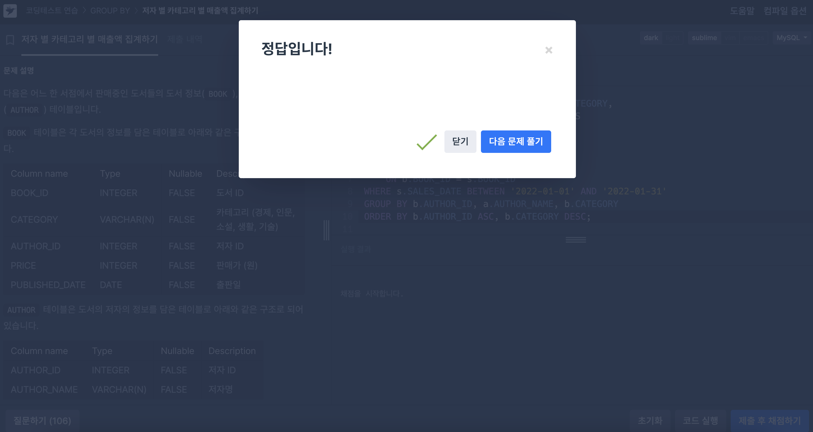

# [25-1W SQL 스터디] 2주차 공부 

## 복합 JOIN 개념정리

MySQL에서 여러 테이블 결합시에 **JOIN** 절을 사용함. 

기본 구문은 다음과 같다.

~~~sql
table_references:
    escaped_table_reference [, escaped_table_reference] ...

escaped_table_reference: {
    table_reference
  | { OJ table_reference }
}

table_reference: {
    table_factor
  | joined_table
}
~~~

**테이블 참조(table_reference)**

- 테이블 참조는 실제 테이블을 가리키는 것이며, **PARTITION**절을 포함할 수 있어 특정 파티션에서만 데이터를 선택이 가능함.

**테이블 결합(Joined_Table)**

- 여러 JOIN 을 사용할 수 있으며, **ON**이나 **USING**을 사용해 테이블 결합이 가능함. 

### JOIN의 종류

**1. LEFT JOIN / RIGHT JOIN**

- LEFT JOIN : 왼쪽 테이블에 있는 모든 행을 포함하며, 오른쪽 테이블에서 매칭되는 행이 없으면 NULL로 채워짐.
- RIGHT JOIN : 오른쪽 테이블에 있는 모든 행을 포함하며, 왼쪽 테이블에서 매칭되는 행이 없으면 NULL로 채워짐.

**2. NATURAL JOIN**

- 두 테이블에서 공통된 이름을 가진 컬럼을 자동으로 사용하여 결합함. 이때 중복된 컬럼은 결과에서 제외됨.

> 흔히 JOIN이라고 아무 키워드도 없이 SQL상에서 JOIN을 할 경우에는 NATURAL JOIN을 사용함.

**3. STRAIGHT JOIN / INNER JOIN**

- STRAIGHT JOIN : 기본 JOIN과 비슷하지만, 왼쪽 테이블을 먼저 읽도록 강제함.
- INNER JOIN, CROSS JOIN은 구문적으로 동일하게 처리하며, 카르테시안 곱을 사용함.

JOIN 의 주의 사항

결합된 테이블의 컬럼명이 동일하다면, 중복된 컬럼을 하나로 합쳐서 출력한다. 예를 들어, NATURAL JOIN과 USING을 사용할 때 중복된 컬럼은 제거된다. 

- USING과 ON 차이점

1. USING : 두 테이블에서 동일한 이름을 가진 컬럼을 자동으로 사용하여 결합함. 
2. ON : 각 컬럼을 명시적으로 지정하여 결합 조건을 설정함. 

---

## GROUP BY + HAVING 개념정리

**GROUP BY와 비집계(Non-Aggregate) 컬럼**

SQL에서 GROUP BY는 결과를 그룹으로 묶는데 사용함. 집계함수가 있을 때 그룹별고 계산됨.

> 그룹에 포함되지 않은 비집계 컬럼을 HAVING절에 포함하기 위해서, 해당 컬럼이 그룹화된 컬럼에 종속적이여야함. 

**기능적 종속성(functional dependence)** 검사

- SQL-1999 이후에는 GROUP BY 절에 명시되지 않은 비집계 컬럼을 SELECT와 HAVING 절에서 사용될 수 있는 **선택적 기능**을 제공함. 

**DISTINCT / ORDER BY**

DISTINCT와 ORDER BY가 함께 사용될 때, ORDER BY의 기준이 SELECT 목록에 없는 비집계 컬럼일 경우, GROUP BY와 결합된 쿼리가 무작위로 정렬될 수 있기 때문에 오류를 방지하기 위해 이러한 쿼리를 거부할 수 있다. 

**HAVING / ALIAS**

MySQL은 HAVING 절에서 SELECT 리스트의 별칭(alias)을 사용할 수 있도록 확장이 되어있음. 

>  MySQL 기능에만 가능한 기능임. 

~~~sql
SELECT name, COUNT(name) AS c
FROM orders
GROUP BY name
HAVING c = 1;
~~~

AS : 별칭 사용하는 키워드

GROUP BY 절에서는 **비컬럼 표현식(non-column expression)**을 사용할 수 있도록 확장되어있음. 

수학적 연산이나, 함수 호출을 사용할 때도 GROUP BY에 사용이 가능함. 

Ex)

~~~sql
SELECT id, FLOOR(value/100) AS val
FROM tbl_name
GROUP BY id, val;
~~~

---

## 복합 JOIN & GROUP BY + HAVING 문제풀이

### Q1. 저자별 카테고리 별 매출액 집계하기

<!-- Q1 문제 해결 사진 첨부 -->

- 해결방법

BOOK 테이블을 기준으로 쿼리를 시작했다. 먼저, AUTHOR 테이블과 AUTHOR_ID를 기준으로 JOIN하였고, BOOK_SALES 테이블과는 BOOK_ID를 기준으로 JOIN 하였다. 이렇게 각각의 테이블에 대한 정보를 받아올 수 있도록 한 이후에 2022년 1월 1일부터 1월 31일까지에 대한 정보를 받아올 수 있게 *BETWEEN*을 활용하였고, **SUM**이라는 집계함수를 사용해 판매량과 판매가의 곱이 나오도록 하고, TOTAL_SALES의 별칭을 만들어서 문제의 조건에 맞게 수정하였다. 또한, 집계함수를 사용했기에 그 외에 SELECT 하는 부분을 그룹화하고, 정렬을 문제의 조건에 맞게 설정하여 해결했다. 

~~~sql
JOIN AUTHOR a
    ON b.AUTHOR_ID = a.AUTHOR_ID
JOIN BOOK_SALES s
    ON b.BOOK_ID = s.BOOK_ID
~~~

> 개념에서 배운 ON 조건을 활용하여 명시적으로 지정을 해주긴 하였지만, 이미 AUTHOR_ID, BOOK_ID와 겹치는 컬럼이 존재하기에 ON을 사용하지 않아도 NATURAL JOIN이 자동적으로 되어 문제에 푸는데 바꿔서 풀어도 상관이 없음을 확인할 수 있었다. 

---

### Q2. 언어별 개발자 분류하기

<!-- Q2 문제 해결 이미지 넣기 -->

- 해결방법

> 우선, SQL내에서 비트연산을 할 수 있는지 몰랐어서BIT_OR(CODE) 부분에서 비트 OR 연산 처리하는과정에서 오래걸렸다.. 

~~~sql
WITH SKILL_CODES AS (
    SELECT BIT_OR(CODE) AS SKILL_CODE 
    FROM SKILLCODES 
    GROUP BY CATEGORY 
    HAVING CATEGORY = 'Front End'
)

~~~

먼저 SKILL_CODES 라는 가상 테이블을 만들어 Front END에 속하는 모든 스킬 코드를 합산해 값으로 저장하는 테이블을 만들었다. 비트 OR 연산을 수행해 **하나의 SKILL_CODE**를 만들었다. 

예를들어 

~~~yaml
2048 | 8192 | 16 = 10256
~~~

각 값에 2진수에 있는 숫자가 있으면 이를 다 더해주는 테이블이라고 생각하면 된다. 

그 이후에는 

~~~sql
WITH SKILL_GRADE AS (
    SELECT
        CASE
            WHEN d.SKILL_CODE & s.SKILL_CODE 
                AND d.SKILL_CODE & (SELECT CODE FROM SKILLCODES WHERE NAME = 'Python')
                THEN 'A'
            WHEN d.SKILL_CODE & (SELECT CODE FROM SKILLCODES WHERE NAME = 'C#') 
                THEN 'B'
            WHEN d.SKILL_CODE & s.SKILL_CODE 
                THEN 'C'
            ELSE NULL
        END AS GRADE, d.ID, d.EMAIL
    FROM DEVELOPERS d, SKILL_CODES s
)
~~~

SKILL_GRADE 테이블을 제작해 CASE 문을 (*코딩에서 IF문과 같은 역할*) 활용해 문제의 조건에 맞게 등급을 구분해주었다. 그리고 각 개발자의 스킬을 **카테시안 조인**을 하였다. 

~~~sql
SELECT GRADE, ID, EMAIL
FROM SKILL_GRADE
WHERE GRADE IS NOT NULL
ORDER BY GRADE, ID;
~~~

마지막으로 GRADE가 존재하는 IS NOT NULL 개발자에서 뽑는 코드를 적고, GRADE, ID, EMAIL을 정렬하여 뽑아내도록 하였다.

> 마찬가지로 여기서 GRADE 가 존재하는 부분에 IS NOT NULL 부분을 생각하지 못해내어서 마지막 쯤에 결과 값이 나오지 않아 고민을 많이 했었다. 

요약하면

1. 개발자의 모든 스킬 코드를 **BIT_OR**로 결합하여 하나의 **SKILL_CODE**에 저장
2. DEVELOPERS 와 SKILL_CODES를 조인
3. **CASE**문을 사용해 **A,B,C** 등급을 부여
4. **등급이 존재하는 개발자**들만 조회하여 정렬을 하여 반환

이다. 
