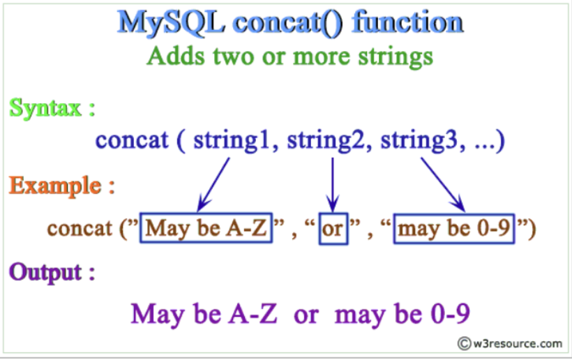
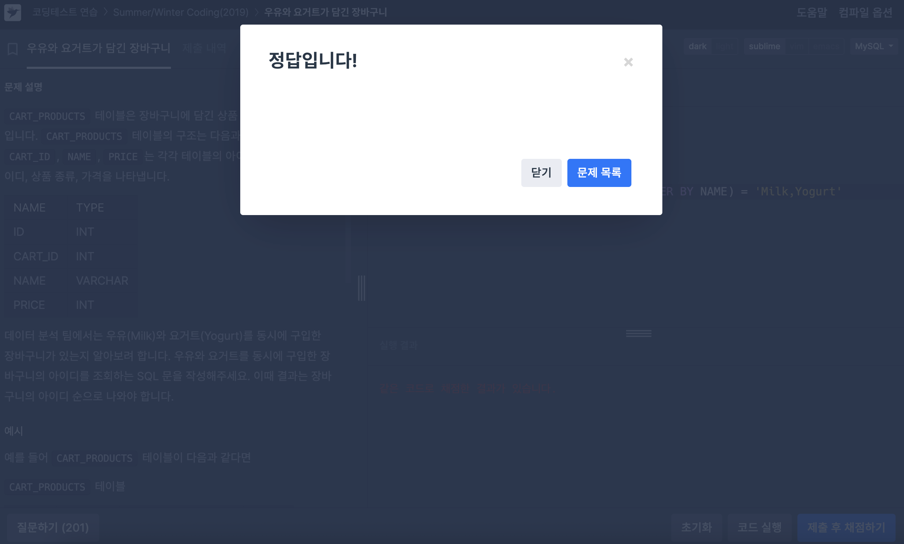
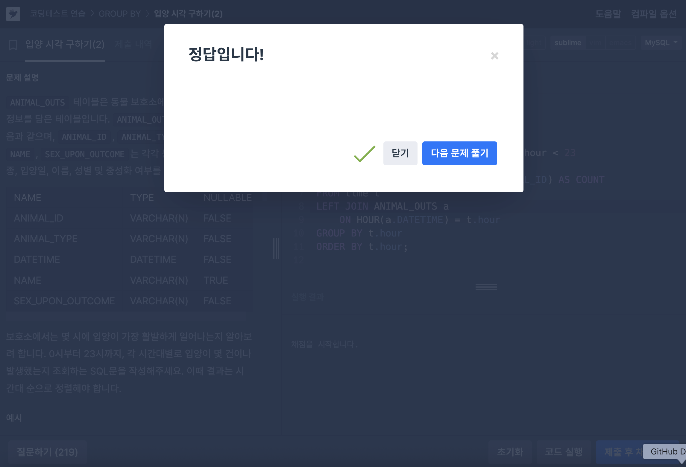

# [25-4W SQL 스터디] 4주차 공부 

## CTE, GROUP_CONCAT() 개념정리

### GROUP_CONCAT() 함수 

GROUP_CONCAT() : 이 함수는 **같은 그룹에 속한 값들을 연결(concatenate)**하여 하나의 문자열로 반환하는 함수이다. 주로, GROUP BY와 함께 사용하고 그룹별 데이터를 하나의 행으로 요약할 때 유용하다. 

<!-- concat 이미지 첨가 -->

~~~mysql
GROUP_CONCAT([DISTINCT] expr [, ...]
             [ORDER BY {unsigned_integer | col_name | expr} [ASC | DESC] [, ...]]
             [SEPARATOR str_val])
~~~

설명을 하면, 

- DISTINCT : 중복되는 값을 제거하고 고유한 값들만 연결해주는 기능 
- expr : 연결할 대상 컬럼이나 표현식, 여러개 사용 가능
- ORDER BY : 연결되는 값들의 정렬 순서를 지정할 수 있음.
- SEPARATOR : 기본 구분자는 쉼표(,) 이며, 원하는 구분자 (str_val)로 변경이 가능함.  

주의사항

- 반환되는 문자열 길이는 시스템 변수인 group_concat_max_len에 의해 제한 가능
- 길이를 늘리고 싶으면 아래처럼 사용 가능

~~~mysql
SET [SESSION | GLOBAL] group_concat_max_len = 값;
~~~

요약 (GROUP_CONCAT) 

> **같은 그룹의 여러 값을 하나의 문자열로 연결해주는 함수**이다. 예 : A, B, C -> 'A,B,C'

> **GROUP BY**와 함께 자주 사용한다. 

---

CONCAT 함수에 대해 복습을 한번 아래 진행해보았다. 

> CONCAT 함수의 특징: 함수 내부의 인자로 작성하여 인자와 인자 사이는 콤마로 구분하면 연결되어 출력함.

CONCAT 함수 참고사항

- CONCAT의 인수 중 하나라도, NULL 값이 들어가 있으면 그것은 NULL로 출력
- CONCAT 함수의 return 반환형은 string 타입 

---

### CTE(WITH RECURSIVE)

WITH RECURSIVE : **재귀적 CTE**를 정의할 때 사용한다. **자기 자신을 참조하면서 계층적 구조나 반복적인 계산을 수행할 수 있게 해준다.**

- 기본 문법

~~~mysql
WITH RECURSIVE cte_name (column_list) AS (
    -- Anchor member (초기값)
    SELECT ...
    UNION [ALL]
    -- Recursive member (자기 참조)
    SELECT ... FROM cte_name WHERE ...
)
SELECT * FROM cte_name;
~~~

Anchor member : 재귀의 시작점으로 초기 결과를 말함.

Recursve member : 이전 결과를 참조하여 다음 결과를 생성한다.

UNION / UNION ALL : 결과를 합친다. 

> UNION : 중복 제거 / UNION ALL : 중복 허용

종료 조건 : 재귀를 할 때는 **무한 루프**를 돌지 않도록 재귀의 종료 조건을 무조건 명시해야함. 

요약 (CTE)

WITH RECURSIVE는 **자기 자신을 반복해서 호출할 수 있는 SQL문**, 주로 재귀구조는 계층 구조나(트리 형태의 자료구조), 순차적 데이터 , 그래프 탐색에서 사용된다. 

즉, 어떤 데이터가 **자기 자신을 참조하면서 계속 확장**되어야 할 때 사용해야한다.

대표적인 예시를 들면 학교 교육과정에 선수과목이 있는 상황에서는 자기 자신을 계속 재귀하면서 선수과목부터 끝 과목까지 연결할 수 있을 것이다. 

---

## GROUP_CONCAT & CTE 문제풀이

### Q1. 우유와 요거트가 담긴 장바구니

<!-- Q1 답 -->

- 해결방법

먼저 문제의 조건에 맞게 WHERE 절에서 NAME에 우유와 요거트를 가지고 있는 상품의 행들만 가져올 수 있도록 하였다. 그리고 HAVING 절에서 GROUP_CONCAT을 사용해서 알파벳 순으로 정렬한 문자열을 생성하여 두 상품이 모두 존재할 때를 만족할 수 있도록 하였다. 

사실 이 문제는 GROUP_CONCAT 방식보다는 GROUP BY + HAVING 절을 사용하는 것이 더 바람직한 문제이다. GROUP_CONCAT 을 사용하는 것은 문자열을 결합하는 연산이 있기에 문자열 연산을 하는 진행에서 메모리 사용량이 훨 안좋은 상황이다. 따라서 위 문제와 같은 정확한 조건 체크를 가능하도록 하는 문제를 사용할 때는 `GROUP BY + HAVING ` 절을 사용해 단순 집계를 하는 것이 더 좋다. 단순히 GROUP BY + HAVING 절은 아래와 같이 사용할 수 있다. 

~~~mysql
SELECT CART_ID
FROM CART_PRODUCTS
WHERE NAME IN ('Milk', 'Yogurt')
GROUP BY CART_ID
HAVING COUNT(DISTINCT NAME) = 2
ORDER BY CART_ID;
~~~

### Q2. 언어별 개발자 분류하기 

- 해결방법

개발자의 스킬 정보를 문자열로 변환한 후에 문자열 비교를 부여하는 구조로 진행했다. 이미 기술 스킬 목록을 문자열로 만들었기 때문에 특정 조건에 따라서 GRADE를 지정하고, 그 결과를 GRADE, ID, EMAIL 순으로 출력하도록 했다. 

~~~mysql
WITH DEVELOPER_SKILLS AS (
    SELECT
        d.ID,
        d.EMAIL,
        GROUP_CONCAT(s.NAME ORDER BY s.NAME) AS SKILL_LIST
    FROM DEVELOPERS d
    JOIN SKILLCODES s
        ON d.SKILL_CODE & s.CODE
    GROUP BY d.ID, d.EMAIL
),
SKILL_GRADE AS (
    SELECT
        ID,
        EMAIL,
        CASE
            WHEN SKILL_LIST LIKE '%Front End%' AND SKILL_LIST LIKE '%Python%' THEN 'A'
            WHEN SKILL_LIST LIKE '%C#%' THEN 'B'
            WHEN SKILL_LIST LIKE '%Front End%' THEN 'C'
            ELSE NULL
        END AS GRADE
    FROM (
        SELECT ds.ID, ds.EMAIL, 
               GROUP_CONCAT(sc.CATEGORY) AS SKILL_LIST
        FROM DEVELOPER_SKILLS ds
        JOIN SKILLCODES sc
            ON FIND_IN_SET(sc.NAME, ds.SKILL_LIST)
        GROUP BY ds.ID, ds.EMAIL
    ) t
)
SELECT GRADE, ID, EMAIL
FROM SKILL_GRADE
WHERE GRADE IS NOT NULL
ORDER BY GRADE, ID;
~~~

### Q3. 입양 시각 구하기(2) 

<!-- Q3 답 -->

- 해결방법 

입양 기록이 있는지 없는지에 관계없이 0시부터 23시까지 모든 시간대에 입양 건수를 구하는 것이 목표이기 때문에 시간을 저장해주는 임시 테이블을 생성했다. 0부터 시작하여 하나씩 증가하는 값들을 다 재귀적으로 생성하였고, 23보다 작다는 조건으로 재귀의 탈출 조건을 작성하였다. 그리고 이 값은 UNION ALL로 통해서 작성하였다. 

메인 쿼리에서는 시간값 테이블과 ANIMAL_OUTS 테이블과의 조인을 진행하고 시간대에 입양된 동물 들을 연결하였다. 그 이후에 동물이 있는 경우와 없는 경우를 COUNT로 세서 계산하였고, 시간대별로 그룹핑해서 건수를 계산하여 마지막 조건에 맞게 시간대 순으로 정렬을 하여 출력하도록 하였다. 
