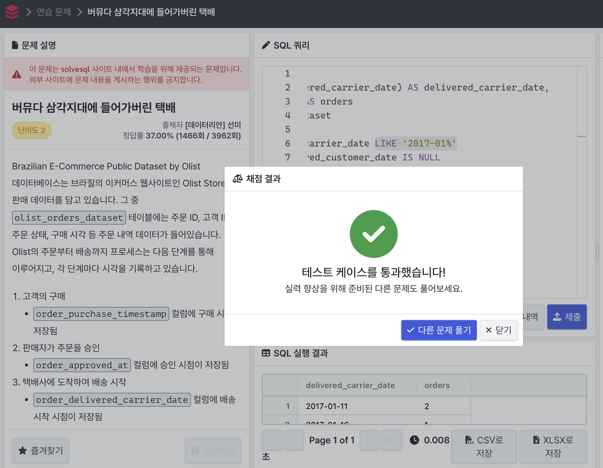
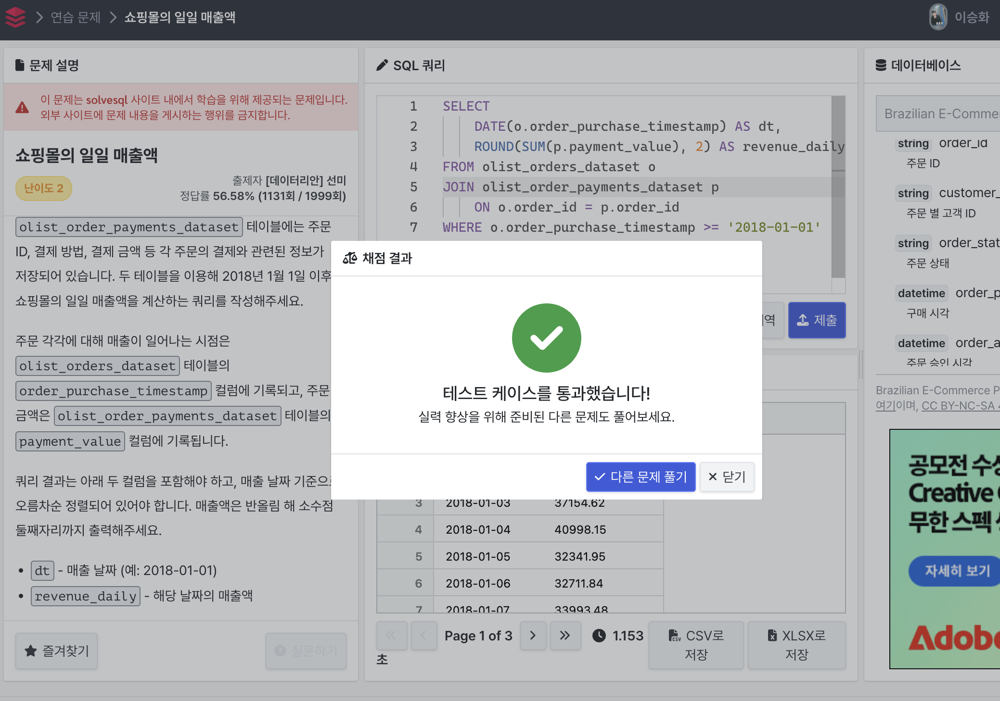

## Q1. 버뮤다 삼각지대에 들어가버린 택배 

- 정답 코드 

~~~sql
SELECT 
    DATE(order_delivered_carrier_date) AS delivered_carrier_date, 
    COUNT(order_id) AS orders
FROM olist_orders_dataset
WHERE 
    order_delivered_carrier_date LIKE '2017-01%'
    AND order_delivered_customer_date IS NULL
GROUP BY DATE(order_delivered_carrier_date)
ORDER BY delivered_carrier_date;
~~~

- 해결방법

문제의 조건에 맞게 날짜와 order 개수를 선택해주었다. 그 이후에 2017년 1월 이기에 WHERE 조건에 배달한 날짜가 2017년 1월이라는 조건을 걸어두었다.  처음에 이 부분에서 

~~~sql
WHERE 
    order_delivered_carrier_date BETWEEN '2017-01-01' AND '2017-01-31'
~~~

이렇게 했는데, 정답의 레코드는 7개인데 6개라고 떴어서 따로 이 부분은 2017년 1월을 인식하는 부분에서 LIKE를 사용해 가져올 수 있다고 하여 바꿔서 해결하였다. 그 외에 COUNT 라는 집계함수를 사용했기에 다른 DATE 에 대해 그룹화를 진행하고, 오름차순으로 정렬하여 문제를 해결했다. 

## Q2. 쇼핑몰의 일일 매출액 

- 정답 코드

~~~sql
SELECT 
    DATE(o.order_purchase_timestamp) AS dt,
    ROUND(SUM(p.payment_value), 2) AS revenue_daily
FROM olist_orders_dataset o
JOIN olist_order_payments_dataset p 
    ON o.order_id = p.order_id
WHERE o.order_purchase_timestamp >= '2018-01-01'
GROUP BY dt
ORDER BY dt;
~~~

- 해결방법

위에 Q1번과 비슷한 느낌으로 DATE를 가져오고, 결제 금액의 총합을 SELECT 했다. 문제의 조건에 소수점 둘 째 자리에서 반올림 하라고 하였고, 결제금액의 합계를 구하라고 하여 집계함수와 ROUND 함수까지 같이 사용해 불러오도록 했다. 

 그 이후에는 payments 테이블과 주문 ID로 조인하여 2018년 1월 1일 이후에 대한 정보를 가져오도록 하였다. 마지막으로는 집계함수가 있기에 GROUP BY를 적용하고, 문제에 맞게 오름차순 정렬도 하여 문제를 해결할 수 있었다. 
