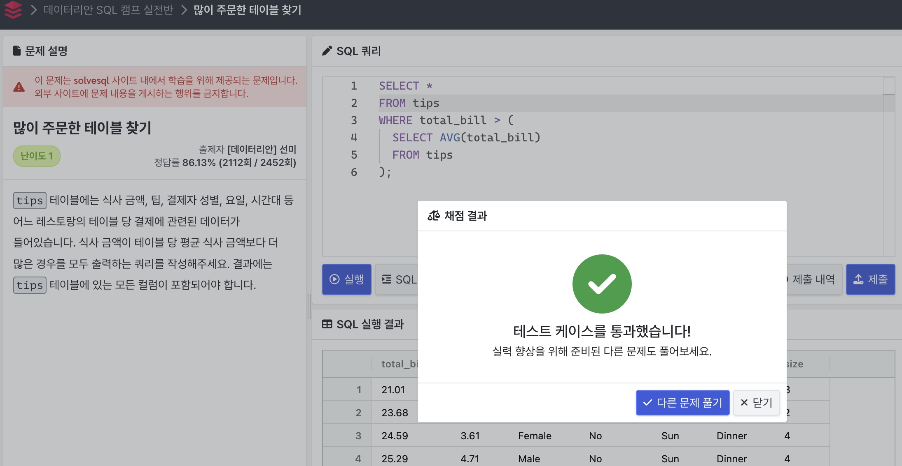
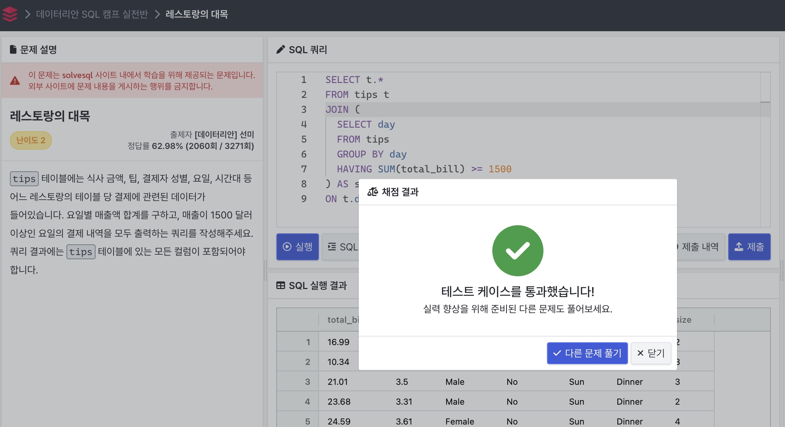
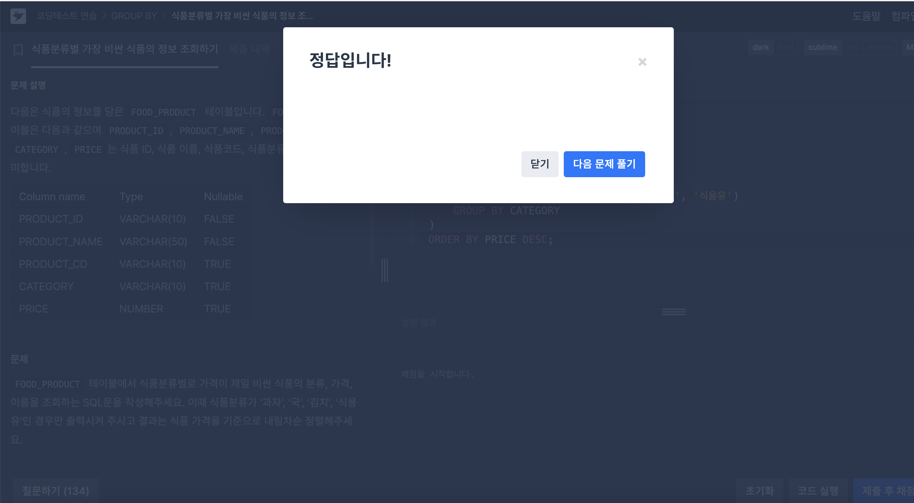

# [25-0W SQL 스터디] 0주차 공부 

## 서브쿼리 개념정리 
### 서브쿼리 (Subquery)란?
#### 15.2.15
서브쿼리는 다른 SQL 쿼리 내에 포함된 SELECT문을 의미함.
- 서브쿼리의 장점
1. 쿼리를 구조적으로 분리하여 각 부분을 독릭접으로 처리 가능
2. 복잡한 join 이나 union 을 대체하는 방식으로 유용함.
3. 많은 사람들이 서브쿼리를 복잡한 조인보다 가독성이 높다고 생각함. 

#### 15.2.15.2
- 서브쿼리를 사용한 비교 
일반적인 사용법 : non_subquery_operand comparison_operator (subquery)
특징: 
1. 서브쿼리는 비교 연산자 오른쪽에 위치하고, 비교 연산자로는 수학적 비교 계산 뿐만 아니라 LIKE 연산자도 사용이 가능함. 
2. 서브쿼리를 사용하면 집계 함수나 특정 조건에 맞는 값을 비교가 가능함. 

#### 15.2.15.3
- ANY : 서브쿼리에서 반환된 값 중 하나라도 비교 연산자가 참이면 TRUE를 반환.
- IN = ANY, IN은 ANY의 별칭
- SOME = ANY : SOME도 ANY의 별칭, 동등한 의미

#### 15.2.15.4 
- ALL 키워드 : 서브쿼리에서 반환되는 모든 값에 대해 비교 연산자가 참인지를 확인 
> 만약 서브쿼리의 결과가 비워있을 땐, 'TRUE'를 반환
- NOT IN = <> ALL : 두 개는 동일. 두 키워드 모두 서브쿼리의 값이 'FALSE' 일 떄 참을 반환

#### 15.2.15.6
- EXISTS : 서브쿼리내에 하나 이상의 행이 존재하면 'TRUE' 반환
- NOT EXISTS : 행이 없을 떄 'TRUE' 반환

#### 15.2.15.10
- 서브쿼리에서 생길 수 있는 오류들의 종류
1. LIMIT & IN/ALL/ANY/SOME 서브쿼리는 MySQL에 지원되지 않는 구문
2. 서브쿼리가 반환하는 컬럼 수가 맞지 않으면 오류 발생, 
3. 서브쿼리에서 하나 이상의 행을 반환하면 =, IN 등을 사용할 수 없고, ANY를 사용해야함.
4. 서브쿼리에서 업데이트 대상 테이블을 직접 참조하면 오류 발생
> 4번 문제의 해결을 위해 CTE나 파생 테이블(WITH)을 사용해야함. 

## 서브쿼리 문제풀이
### Q1. 많이 주문한 테이블 찾기 

> Q1 문제풀이 설명
> tips 테이블에서 식사 금액이 전체 평균 식사 금액보다 큰 행을 모두 조회하는 SQL 문으로, total_bill값이 tips 테이블에 있는 모든 식사 금액의 평균보다 큰 행들을 선택하도록 했다. 서브쿼리에서는 전체 total_bill의 평균값을 반환하도록 했고, WHERE 절에서 그 평균값보다 큰 비교문을 작성하여 해결했다. 

### Q2. 
### Q2. 레스토랑의 대목

> Q2 문제풀이 설명
> 먼저 서브쿼린 내에서는 SUM이라는 집계함수를 사용해서 GROUP BY를 활용해 요일별로 그룹화를 진행했다. 그렇게 하여 요일별로 total_bill이 1500 이상인 요일들을 선별했고, 메인쿼리는 이 서브쿼리와 JOIN 함으로써 서브쿼리에서 얻은 요일과 원래 tips에 있는 요일과 같은 날짜를 선별해 전체값들을 메인 쿼리의 테이블로부터 전체 컬럼을 받아오는 방법을 활용해 해결했다. 

## CTE 개념정리 
- CTE 정의
CTE는 WITH 키워드로 시작. CTE를 사용하기 위해, CTE 이름과 그에 해당하는 서브쿼리 정의가 필요함. 즉, 이름이 붙은 임시 결과 테이블을 만든 것과 같음. 그 이후에 SQL 메인 쿼리에서 참조가 가능. 하나의 SQL 문장 내에서만 유효함. 외부 쿼리에서는 불러오기 불가능.

- CTE 특징 & 장점
1. CTE 내에서 하나 이상의 서브쿼리 정의 가능. 서브쿼리에 각각 이름을 지정할 수도 있음. 그 이름을 통해 쿼리 내에서 참조가 가능함. 
2. CTE는 재사용이 가능함. 여러번 참조할 수 있기에 코드를 간결하고 쉽게 만들 수 있음. 코딩 시에 여러번 사용하는 함수를 함수화하는 것과 같은 기능이라고 생각하면 됨.
> 여러번 반복되는 서브쿼리를 CTE로 대체하면 유용함.
> 중간 결과를 저장하고, 이를 이후 쿼리에서 여러 번 참조하는데 유리함. 
3. 쿼리의 가독성이 좋음. 

## CTE 문제 풀이
### Q3. 식품분류별 가장 비싼 식품의 정보 조회하기 - 서브쿼리 활용

> Q3 - 서브쿼리 문제풀이 설명
> 서브쿼리를 활용했을 때는 각 분류별로 가격이 가장 비싼 식품을 구하고, IN 을 활용해 문제에 맞게 카테고리를 필터링했다. 그래서, 메인 쿼리에서는 서브쿼리에 있는 값들을 한번 더 IN을 사용해 카테고리와 그에 맞는 최고의 가격을 불러오고, 이를 DESC로 내림차순하여 렬하여 해결했다. 

> Q3 - WITH 문제풀이 설명
> WITH을 사용하는 부분 내에 테이블을 만드는것에는 위의 서브쿼리와 큰 차이점이 없었다. 다만, CTE를 활용한 테이블의 alias와 메인 쿼리의 테이블의 alias를 지정했을 때 두개의 별칭을 헷갈리지 않게 사용하는 것이 중요한 것 같다. WITH을 활용해 각 카테고리별로 최고 가격을 찾고, 문제의 조건에 맞는 항목을 선택하도록 하였다. 그 이후에는 메인 쿼리에서 가상 테이블과 JOIN을 함으로써 두 개의 항목이 AND를 활용해 둘 다 같음을 활용해 출력할 수 있도록 하여 해결했다. 

- 서브쿼리 VS WITH 
일단, 나의 SQL 푸는 방식은 서브쿼리를 짜는 것이 더 가깝다. 쿼리 내에서 한번의 IN 조건을 사용하기도 하고, 일회성이긴 하지만 이런식으로 간단히 문제를 푸는 것에 있어서는 빠르게 구현이 가능하다는 장점이 존재한다.
하지만, WITH을 사용했을 때, 지금은 선택할 항목이 별로 안되긴하지만 작은 데이터셋을 가져올 때 테이블을 가상으로 만드는 것이기에 성능이 저하가 올 수도 있지만, 큰 데이터셋에 있어서 디버깅도 편하고, 재사용성과 가독성을 높여주기에 성능 최적화에 좋은 코드로 보였다. 다만, 쿼리 길이가 길고, 모든 DBMS가 CTE를 지원하지 않다는 단점이 존재하긴한다. 
> 결론 : CTE를 활용해서 푸는 연습을 좀 더 해야겠다. WITH으로 가상 테이블을 만드는 것 까진 쉽게 했지만 출력하는 부분에서 애를 좀 많이 먹었다. 

